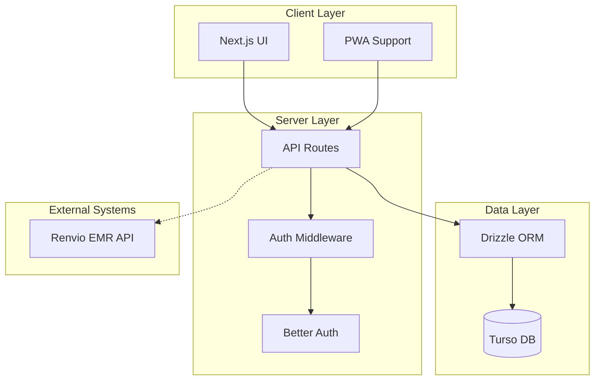
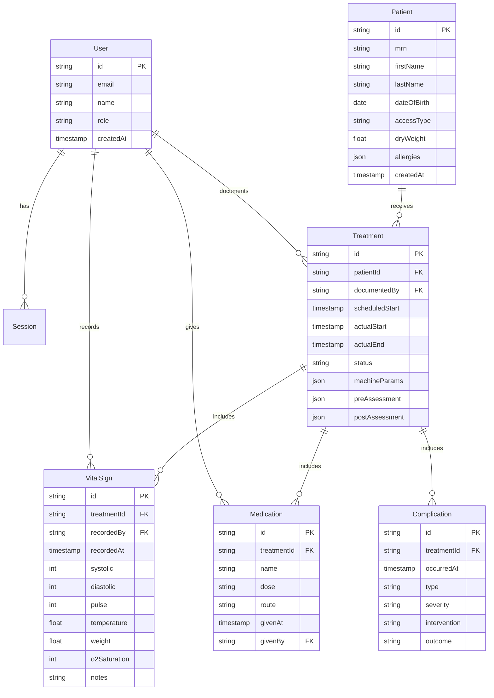
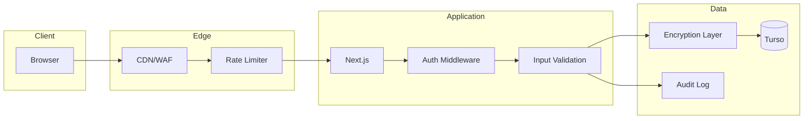

## System Overview

The Renvio Companion App follows a modern full-stack architecture using Next.js App Router with server-side rendering for security and performance.



## Application Structure

### Frontend (Next.js App Router)

```text
src/app/
├── (auth)/                      # Protected routes
│   ├── layout.tsx               # Auth-required layout
│   ├── dashboard/
│   │   └── page.tsx             # Main dashboard
│   ├── patients/
│   │   ├── page.tsx             # Patient list
│   │   └── [id]/
│   │       ├── page.tsx         # Patient detail
│   │       └── treatment/
│   │           └── page.tsx     # Active treatment
│   ├── flowsheet/
│   │   └── [treatmentId]/
│   │       └── page.tsx         # Flowsheet charting
│   └── settings/
│       └── page.tsx             # User settings
├── (public)/                    # Public routes
│   ├── layout.tsx               # Public layout
│   ├── page.tsx                 # Landing/login
│   └── login/
│       └── page.tsx             # Login page
└── api/                         # API routes
    ├── auth/[...all]/
    │   └── route.ts             # Better Auth handler
    ├── patients/
    │   └── route.ts             # Patient CRUD
    ├── treatments/
    │   └── route.ts             # Treatment CRUD
    ├── vitals/
    │   └── route.ts             # Vitals entry
    └── flowsheet/
        └── route.ts             # Flowsheet operations
```

### Component Structure

```text
src/components/
├── ui/                          # shadcn/ui base components
│   ├── button.tsx
│   ├── card.tsx
│   ├── input.tsx
│   └── dialog.tsx
├── flowsheet/                   # Flowsheet-specific
│   ├── flowsheet-grid.tsx       # Main charting grid
│   ├── flowsheet-row.tsx        # Single time entry row
│   ├── flowsheet-header.tsx     # Column headers
│   └── flowsheet-summary.tsx    # Treatment summary
├── vitals/                      # Vitals capture
│   ├── vitals-form.tsx          # Quick entry form
│   ├── bp-input.tsx             # Blood pressure input
│   ├── weight-input.tsx         # Weight with conversion
│   └── vitals-display.tsx       # Vitals card display
├── patient/                     # Patient components
│   ├── patient-card.tsx         # Patient summary card
│   ├── patient-header.tsx       # Patient info header
│   └── patient-alerts.tsx       # Allergy/alert badges
└── treatment/                   # Treatment components
    ├── treatment-timer.tsx      # Time on/remaining
    ├── treatment-status.tsx     # Status indicator
    └── treatment-params.tsx     # Machine parameters
```

## Data Models

### Entity Relationship Diagram



## API Structure

### RESTful Endpoints

| Method | Endpoint | Description |
|--------|----------|-------------|
| **Patients** |
| GET | `/api/patients` | List patients (paginated) |
| GET | `/api/patients/:id` | Get patient details |
| POST | `/api/patients` | Create patient |
| PATCH | `/api/patients/:id` | Update patient |
| **Treatments** |
| GET | `/api/treatments` | List treatments (with filters) |
| GET | `/api/treatments/:id` | Get treatment with vitals |
| POST | `/api/treatments` | Create treatment |
| PATCH | `/api/treatments/:id` | Update treatment status |
| POST | `/api/treatments/:id/start` | Start treatment |
| POST | `/api/treatments/:id/complete` | Complete treatment |
| **Vitals** |
| POST | `/api/vitals` | Record vital signs |
| GET | `/api/treatments/:id/vitals` | Get vitals for treatment |
| **Flowsheet** |
| GET | `/api/flowsheet/:treatmentId` | Get full flowsheet |
| POST | `/api/flowsheet/:treatmentId/entry` | Add flowsheet entry |

### Response Format

All API responses follow a consistent format:

```typescript
// Success response
interface ApiResponse<T> {
  success: true
  data: T
}

// Error response
interface ApiError {
  success: false
  error: {
    code: string
    message: string
    details?: Record<string, string[]>
  }
}

// Paginated response
interface PaginatedResponse<T> {
  success: true
  data: T[]
  pagination: {
    page: number
    pageSize: number
    total: number
    totalPages: number
  }
}
```

## Authentication & Authorization

### Better Auth Configuration

Better Auth is configured with Drizzle adapter for self-hosted authentication:

```typescript
// src/lib/auth/config.ts
import { betterAuth } from 'better-auth'
import { drizzleAdapter } from 'better-auth/adapters/drizzle'
import { db } from '@/lib/db'

export const auth = betterAuth({
  database: drizzleAdapter(db, { provider: 'sqlite' }),
  emailAndPassword: {
    enabled: true,
  },
  session: {
    expiresIn: 60 * 60 * 8, // 8 hours (shift length)
    updateAge: 60 * 60, // Refresh every hour
  },
})
```

### Role-Based Access Control

| Role | Permissions |
|------|-------------|
| admin | Full access, user management |
| supervisor | Read all, write own clinic |
| nurse | Read/write assigned patients |
| pct | Read assigned, write vitals only |

## Key Design Decisions

### ADR-001: Turso for Database

**Context:** Need a database for EMR companion app with potential offline support.

**Decision:** Use Turso (libSQL/SQLite) with Drizzle ORM.

**Consequences:**
- Pros: Edge deployment, low latency, simple schema, potential embedded/offline
- Cons: Less feature-rich than Postgres, newer ecosystem
- Alternatives: Supabase (Postgres), PlanetScale (MySQL)

### ADR-002: Next.js App Router

**Context:** Need full-stack framework for healthcare app.

**Decision:** Use Next.js 15 with App Router.

**Consequences:**
- Pros: SSR for security, React Server Components, great ecosystem
- Cons: Vercel-optimized, learning curve for App Router
- Alternatives: Remix, SvelteKit

### ADR-003: Better Auth

**Context:** HIPAA compliance requires self-hosted auth consideration.

**Decision:** Use Better Auth for self-hosted authentication.

**Consequences:**
- Pros: Self-hosted option, HIPAA-friendly, flexible
- Cons: More setup than managed services
- Alternatives: Clerk (managed), NextAuth (established)

## Security Architecture



### Security Layers

1. **Transport:** TLS 1.3 everywhere
2. **Edge:** Rate limiting, WAF rules
3. **Application:** Input validation, CSRF protection
4. **Data:** Encryption at rest, parameterized queries
5. **Audit:** All PHI access logged

## Performance Considerations

### Optimistic Updates
- Vitals entry uses optimistic UI for fast feedback
- Background sync with server
- Rollback on failure with user notification

### Caching Strategy
- Patient list cached with SWR
- Flowsheet data refetched every 30 seconds during active treatment
- Static assets served via CDN

### Bundle Optimization
- Dynamic imports for heavy components (charts)
- Route-based code splitting
- Lazy load non-critical UI

## Future Considerations

### Renvio EMR Integration
- Research Renvio API capabilities
- Bi-directional sync design
- Conflict resolution strategy

### Offline Support
- Service worker for PWA
- IndexedDB for local storage
- Sync queue for offline entries

### Mobile Companion App
- React Native or Expo
- Shared business logic
- Push notifications for alerts
