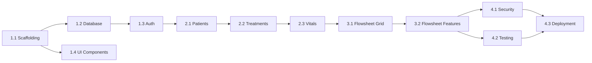

## Overview

A phased implementation plan for building a hemodialysis clinic EMR companion app. Focus on MVP features first, with extensibility for future Renvio EMR integration.

## MVP Scope

### In Scope (v1)
- User authentication (login/logout)
- Patient list with search
- Patient detail view
- Treatment creation and management
- Vital signs entry (quick capture)
- Basic flowsheet view
- Role-based access (nurse, PCT, supervisor)

### Out of Scope (Future)
- Renvio EMR sync/integration
- Offline mode / PWA
- Mobile companion app
- Advanced reporting/analytics
- Multi-clinic support
- Medication scanning

## Implementation Phases

### Phase 1: Foundation (Week 1-2)

Set up project infrastructure and core dependencies.

#### 1.1 Project Scaffolding
- [x] Initialize Next.js 15 with App Router
- [x] Install shadcn/ui
- [x] Configure Tailwind with custom theme
- [x] Set up ESLint + Prettier
- [x] Configure TypeScript strict mode

**Dependencies:** None
**Risk:** Low

#### 1.2 Database Setup
- [x] Install Drizzle ORM and Turso client
- [x] Create Drizzle config
- [x] Define database schema (users, patients, treatments, vitals, medications, complications)
- [x] Set up database client connection
- [ ] Create initial migration
- [ ] Add seed data script for development

**Dependencies:** 1.1
**Risk:** Low

#### 1.3 Authentication
- [ ] Install Better Auth
- [ ] Configure Better Auth with Drizzle adapter
- [ ] Create auth API route handler
- [ ] Build login page UI
- [ ] Create auth middleware for protected routes
- [ ] Implement session management
- [ ] Add user roles to auth context

**Dependencies:** 1.2
**Risk:** Medium (HIPAA considerations)

#### 1.4 Core UI Components
- [x] Install base shadcn components (button, card, input, form, dialog, table)
- [x] Create layout components (header, sidebar, main)
- [x] Build responsive navigation
- [ ] Create loading states and skeletons
- [ ] Add error boundary components
- [x] Create style guide page

**Dependencies:** 1.1
**Risk:** Low

### Phase 2: Core Features (Week 3-4)

Build the primary patient and treatment management features.

#### 2.1 Patient Module
- [ ] Create patients API routes (CRUD)
- [ ] Build patient list page with search/filter
- [ ] Create patient detail page
- [ ] Build patient card component
- [ ] Add patient alerts/allergies display
- [ ] Implement patient creation form

**Dependencies:** Phase 1
**Risk:** Low

#### 2.2 Treatment Module
- [ ] Create treatments API routes
- [ ] Build treatment list (today's schedule)
- [ ] Create treatment detail page
- [ ] Implement treatment status management
- [ ] Build treatment timer component
- [ ] Add machine parameters form
- [ ] Create pre/post assessment forms

**Dependencies:** 2.1
**Risk:** Medium

#### 2.3 Vitals Entry
- [ ] Create vitals API routes
- [ ] Build quick vitals entry form
- [ ] Create BP input component (systolic/diastolic)
- [ ] Add weight input with unit conversion
- [ ] Implement optimistic UI updates
- [ ] Create vitals history display
- [ ] Add vital sign validation rules

**Dependencies:** 2.2
**Risk:** Low

### Phase 3: Flowsheet (Week 5-6)

Build the real-time treatment charting interface.

#### 3.1 Flowsheet Grid
- [ ] Design flowsheet data structure
- [ ] Create flowsheet API routes
- [ ] Build flowsheet grid component
- [ ] Implement row/column headers
- [ ] Add inline editing for cells
- [ ] Create auto-save functionality
- [ ] Build time interval markers

**Dependencies:** Phase 2
**Risk:** Medium (complex UI)

#### 3.2 Flowsheet Features
- [ ] Add medication documentation section
- [ ] Create complication logging
- [ ] Build intervention documentation
- [ ] Implement flowsheet summary/totals
- [ ] Add print/export functionality
- [ ] Create flowsheet validation

**Dependencies:** 3.1
**Risk:** Medium

### Phase 4: Polish & Security (Week 7-8)

Hardening, testing, and deployment preparation.

#### 4.1 Security Hardening
- [ ] Implement comprehensive input validation
- [ ] Add rate limiting to API routes
- [ ] Create audit logging for PHI access
- [ ] Review and test RBAC implementation
- [ ] Add CSRF protection
- [ ] Implement secure headers
- [ ] Security review and penetration testing

**Dependencies:** Phase 3
**Risk:** High (HIPAA compliance critical)

#### 4.2 Testing
- [ ] Write unit tests for utilities
- [ ] Create integration tests for API routes
- [ ] Build E2E tests for critical flows (login, patient lookup, treatment start/end, vitals entry)
- [ ] Achieve 80% code coverage
- [ ] Set up CI pipeline with tests

**Dependencies:** Phase 3
**Risk:** Low

#### 4.3 Deployment
- [ ] Configure production environment
- [ ] Set up Turso production database
- [ ] Configure Vercel deployment (or alternative)
- [ ] Set up environment variables
- [ ] Create deployment checklist
- [ ] Implement monitoring/alerting
- [ ] Document deployment process

**Dependencies:** 4.1, 4.2
**Risk:** Medium

## Risks & Mitigations

| Risk | Likelihood | Impact | Mitigation |
|------|------------|--------|------------|
| HIPAA compliance gaps | Medium | High | Early security review, consult compliance expert |
| Turso limitations | Low | Medium | Abstract DB layer, have Postgres fallback plan |
| Complex flowsheet UI | Medium | Medium | Start with simple grid, iterate |
| Better Auth issues | Low | Medium | NextAuth as backup option |
| Renvio API limitations | Unknown | High | Design for standalone operation first |

## Dependencies Graph

## Success Criteria

### MVP Launch Criteria
- [ ] Users can log in securely
- [ ] Staff can view patient list and details
- [ ] Treatments can be started and completed
- [ ] Vitals can be recorded quickly (less than 10 seconds)
- [ ] Flowsheet displays all treatment data
- [ ] All PHI access is logged
- [ ] 80% test coverage achieved
- [ ] No critical/high security vulnerabilities
- [ ] Response time under 200ms for common operations

### User Acceptance
- [ ] Nurse can complete full treatment documentation
- [ ] PCT can record vitals during rounds
- [ ] Supervisor can review treatment records
- [ ] Workflow is faster than current EMR

## Future Phases

### Phase 5: Renvio EMR Integration
- Research Renvio API capabilities
- Implement bi-directional sync
- Handle conflict resolution
- Add sync status indicators

### Phase 6: Offline/PWA Support
- Service worker implementation
- IndexedDB local storage
- Sync queue for offline entries
- Conflict resolution for offline changes

### Phase 7: Mobile Companion App
- React Native / Expo setup
- Shared business logic
- Push notifications
- Native device features (camera for wound photos)

### Phase 8: Advanced Features
- Analytics dashboard
- Treatment trending
- Quality metrics reporting
- Multi-clinic support

## Notes

- Each phase should end with a working, deployable state
- TDD approach: write tests before implementation
- Regular security reviews throughout development
- User feedback sessions after each major phase
- Documentation updated with each phase completion
